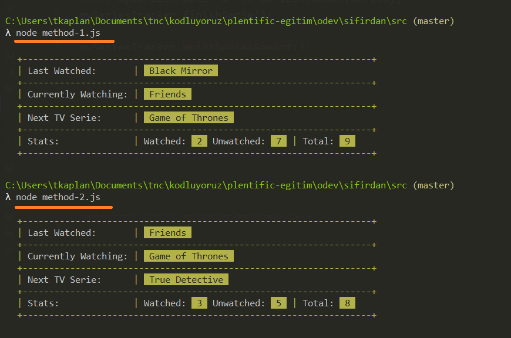
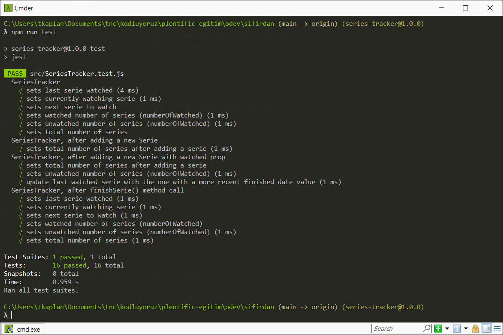

## Task: TV Series Tracker

Projeyi forklayıp `SeriesTracker.js` dosyasındaki değişiklikleri yaptıktan sonra pushlamanız yeterli. Diğer dosyalarda değişiklik yapılması gerekli değil.

### Kurulum

Projeyi kopyaladıktan sonra `npm install` komutu ile yükleyip `npm run test` komutu ile testleri çalıştırabilirsiniz.

### Çalışma Şekli

Uygulama, listenize aldığınız dizilerin izlenmiş ya da o anda izleniyor olma durumlarını saklıyor.
Aynı anda tek dizi izlenebiliyor.  
`mySeriesTracker.add()` methodu ile listeye yeni bir dizi eklenir. (`node method-1.js` komutu ile denenebilir.)  
`mySeriesTracker.finishSerie()` methodu ile mevcut dizi izlenmiş olarak kaydedilip sıradaki dizi şu anda izlenen dizi olarak güncellenir. (`node method-2.js` komutu ile denenebilir.)  
`mySeriesTracker.printSeriesReport()` methodu konsola dizi izleme raporunu gösterir. Bu rapor: **_son izlenen_**, **_şu anda izlenen_** ve **_sıradaki_** dizinin isimleri ile listedeki toplam, izlenen ve henüz izlenmemiş dizilerin sayısını konsola basar.

### Görev

`SeriesTracker.js` dosyası içindeki yorum satırlarına göre SeriesTracker fonksiyonunu çalışır hale getirerek konsolda aşağıdaki ekran görüntülerindeki değerlerin çıkmasını sağlayın.

Methodları denemek için şu komutları çalıştırın:  
`node method-1.js` (`mySeriesTracker.add()` methodunu çalıştırır.)  
`node method-2.js` (`mySeriesTracker.finishSerie()` methodunu çalıştırır.)

`npm run test` komutu ile testleri çalıştırarak tüm testlerin geçtiğinden emin olun.  
Not: `SeriesTracker.test.js` dosyasını inceleyerek istenenleri daha detaylı görebilirsiniz.

### Ekran Görüntüleri

Beklenen Konsol Çıktıları:

Beklenen Test Sonuçları:

